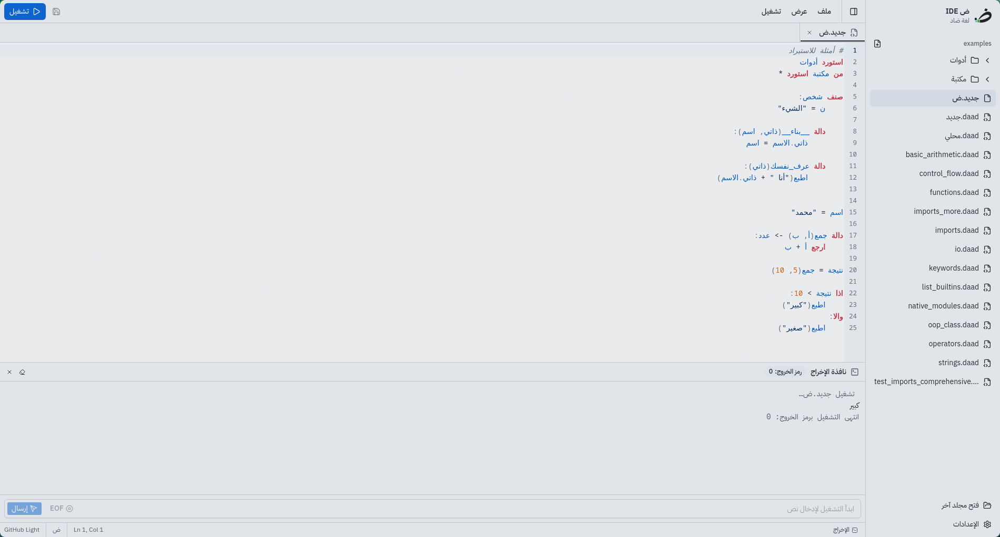
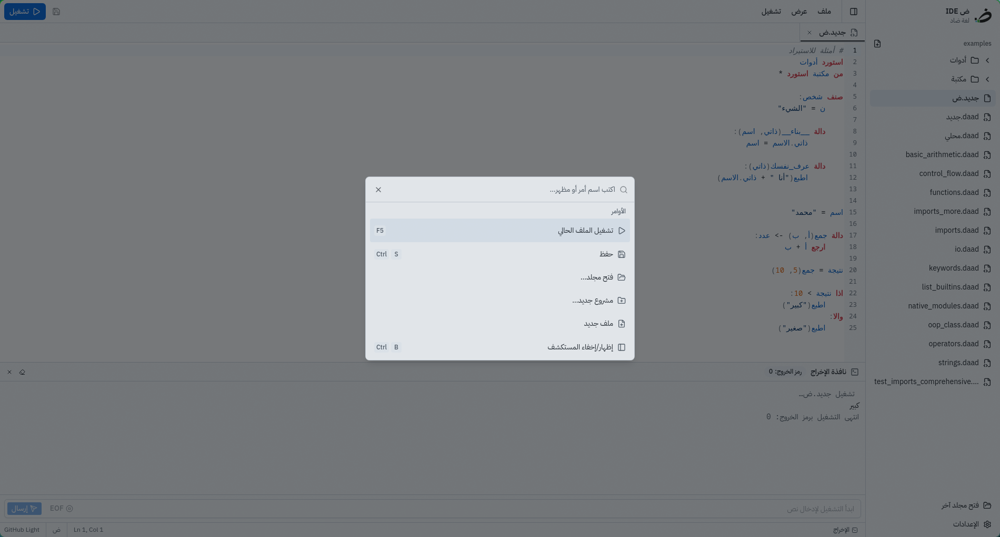
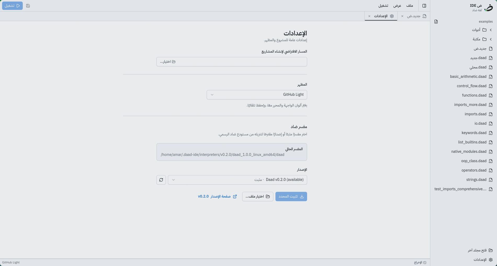

# ض IDE - محرر نصوص لغة ضاد

محرر نصوص  مصمم خصيصاً للبرمجة بلغة **ض (ضاد)**، وهي لغة برمجة عربية مبتكرة. يوفر المحرر بيئة تطوير متكاملة وسهلة الاستخدام مع دعم كامل للكتابة من اليمين إلى اليسار   .





## التطوير

يعتمد المحرر على [Wails](https://wails.io/) لتشغيل واجهة **React + shadcn/ui** داخل تطبيق Go
سطح مكتب. تحتاج إلى Go وNode.js وYarn وWails CLI:

```bash
go install github.com/wailsapp/wails/v2/cmd/wails@v2.16.0
yarn install
wails dev
```

لبناء التطبيق:

```bash
wails build
```

لتطوير الواجهة وحدها في المتصفح (بدون Go، مع بيانات تجريبية):

```bash
yarn dev:frontend
```

### بنية الواجهة

```
frontend/src
├── components/ui     مكوّنات shadcn/ui (مولّدة بدعم RTL، لا تُعدَّل يدويًا)
├── components/ide    مكوّنات المحرر (الشريط الجانبي، التبويبات، الإخراج، ...)
├── store/ide.ts      حالة التطبيق وإجراءاته (Zustand)
├── lib/wails.ts      واجهة مكتوبة الأنواع لدوال Go في app.go
├── lib/themes.ts     الـ 29 مظهرًا (ألوان الواجهة + مظهر CodeMirror)
└── language          دعم لغة ضاد في CodeMirror (محلل + إكمال تلقائي)
```

تُضاف مكوّنات shadcn الجديدة بالأمر `npx shadcn@latest add <component>`؛
إعداد `"rtl": true` في [components.json](components.json) يحوّلها إلى RTL تلقائيًا.

توجد عمليات الملفات والحوار وتشغيل أمر `daad` في [app.go](app.go)، بينما
يستخدم المحرر المحوّل [wails.ts](frontend/src/lib/wails.ts).


##  المساهمة

نرحب بمساهماتكم في تطوير هذا المحرر! يمكنكم:

- فتح Issue لاقتراح ميزة جديدة أو الإبلاغ عن خطأ
- عمل Fork للمشروع وإضافة التحسينات
- إرسال Pull Request مع شرح التغييرات

##  الترخيص

هذا المشروع مرخص تحت رخصة apache-2.0 - راجع ملف [LICENSE](LICENSE) للتفاصيل.
