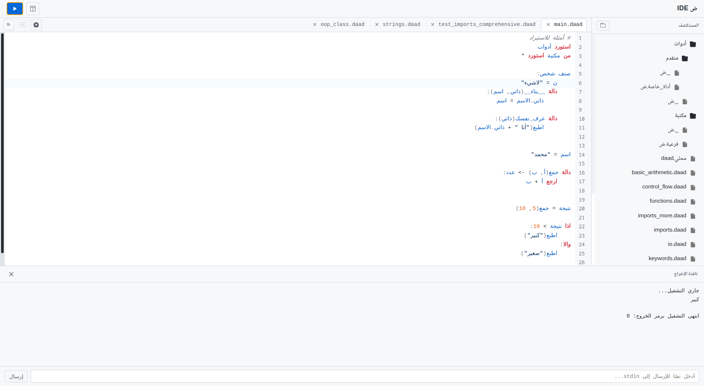

# ض IDE - محرر نصوص لغة ضاد

محرر نصوص  مصمم خصيصاً للبرمجة بلغة **ض (ضاد)**، وهي لغة برمجة عربية مبتكرة. يوفر المحرر بيئة تطوير متكاملة وسهلة الاستخدام مع دعم كامل للكتابة من اليمين إلى اليسار   .



## التطوير

يعتمد المحرر على [Wails](https://wails.io/) لتشغيل واجهة Vite داخل تطبيق Go
سطح مكتب. تحتاج إلى Go وNode.js وYarn وWails CLI:

```bash
go install github.com/wailsapp/wails/v2/cmd/wails@v2.16.0
yarn install
wails dev
```


لبناء التطبيق:

```bash
wails build
```

توجد عمليات الملفات والحوار وتشغيل أمر `daad` في [app.go](app.go)، بينما
يستخدم المحرر محول Wails في [wails-api.js](frontend/wails-api.js).


##  المساهمة

نرحب بمساهماتكم في تطوير هذا المحرر! يمكنكم:

- فتح Issue لاقتراح ميزة جديدة أو الإبلاغ عن خطأ
- عمل Fork للمشروع وإضافة التحسينات
- إرسال Pull Request مع شرح التغييرات

##  الترخيص

هذا المشروع مرخص تحت رخصة apache-2.0 - راجع ملف [LICENSE](LICENSE) للتفاصيل.
